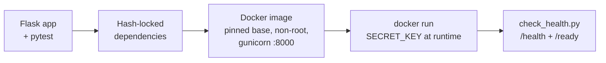

# KubeMentor

KubeMentor is a hands-on Kubernetes learning platform and an end-to-end DevOps portfolio project. The application will teach Kubernetes step by step, and its own infrastructure is built, secured, deployed, and monitored with the same tools and practices it teaches.

Every stage is built in small reviewed steps, includes a deliberate failure drill (predict → break → observe → fix → verify), and is recorded in an [engineering journal](docs/Kubementor_journal).

## Why this project

- **Learn by owning it end to end:** application code, container, CI, Kubernetes, GitOps, security, and monitoring, all in one system.
- **Practise operations, not just setup:** every stage breaks something on purpose and documents the root cause and fix.
- **Keep it low-cost and open source:** everything runs on a laptop first; the cloud stage targets a single cheap VM.

## Architecture

Today, KubeMentor is a tested Flask service packaged as a hardened Docker image:



Target: GitHub Actions CI with Trivy scanning, images deployed to Kubernetes by Argo CD (GitOps), PostgreSQL, secrets from OpenBao/Vault via External Secrets, and Prometheus, Grafana, Loki, and Alertmanager → Slack.

**Full diagrams, components, and design decisions: [docs/architecture.md](docs/architecture.md)**

## What is built

| Area | What exists |
|---|---|
| Application | Flask app factory with `/`, `/health` (liveness), `/ready` (readiness) |
| Configuration | `APP_ENV` chooses dev / testing / production; refuses to start without `SECRET_KEY` in production |
| Tests | pytest suite, isolated from the shell environment |
| Dependencies | `uv`-compiled lock files with sha256 hashes; image installs wheels only |
| Container | Base image pinned by digest, gunicorn, non-root user (uid 10001), patched OS package |
| Smoke test | `scripts/check_health.py` checks `/health` and `/ready`, exits 0 or 1 |

| Endpoint  | Purpose                          | Response                          |
|-----------|----------------------------------|-----------------------------------|
| `/`       | Home page                        | `Welcome to KubeMentor`           |
| `/health` | Liveness: is the process alive?  | `{"status": "healthy"}`, HTTP 200 |
| `/ready`  | Readiness: can it serve traffic? | `{"status": "ready"}`, HTTP 200   |

## Quick start

### Run with Docker

Requires Docker.

```bash
docker build -t kubementor .

docker run -d --name kubementor -p 8000:8000 \
  -e SECRET_KEY="$(python3 -c 'import secrets; print(secrets.token_hex(32))')" \
  kubementor

python3 scripts/check_health.py http://localhost:8000
# /health: OK
# /ready: OK

docker rm -f kubementor
```

Without `SECRET_KEY` the container stops at once with `RuntimeError: SECRET_KEY must be provided in production`. That is intended.

### Run locally for development

Requires Python 3.12.

```bash
python3 -m venv .venv
source .venv/bin/activate
pip install --require-hashes -r requirements-dev.txt

flask --app app.app run
python scripts/check_health.py          # defaults to http://localhost:5000
```

### Run the tests

```bash
pytest
```

The tests always use the testing configuration, so they give the same result whatever is set in your shell.

## Configuration

Configuration is read from environment variables when the application starts.

| Variable     | Values                                 | Default                          | Notes                                  |
|--------------|----------------------------------------|----------------------------------|----------------------------------------|
| `APP_ENV`    | `development`, `testing`, `production` | `development` (`production` in the image) | Unknown values stop the app at startup |
| `SECRET_KEY` | any string                             | none                             | Required in `production`               |

Never commit real secrets; supply them at runtime.

## Dependencies

`requirements.in` and `requirements-dev.in` list what we ask for. The `.txt` files are generated lock files with every package pinned and hashed. Never edit them by hand; see [docs/commands.md](docs/commands.md) to regenerate them.

## Project layout

```text
app/
  __init__.py        create_app() application factory
  config.py          development, testing, and production settings
  app.py             application object for `flask run` and gunicorn
  routes/main.py     blueprint with /, /health, /ready
tests/               pytest suite and shared fixtures
scripts/
  check_health.py    smoke test for /health and /ready
Dockerfile           production image
requirements*.in     top-level dependencies
requirements*.txt    hash-locked dependencies (generated)
docs/
  architecture.md    diagrams, components, design decisions
  Kubementor_journal engineering journal: every session, problem, and fix
  interview-notes.md short STAR stories
  commands.md        command reference
```

## Challenges and solutions

Real problems hit while building, with root causes. Full write-ups are in [docs/interview-notes.md](docs/interview-notes.md) and the [journal](docs/Kubementor_journal).

| Problem | Root cause | Fix |
|---|---|---|
| Tests failed when `APP_ENV=production` was set in my shell | Tests inherited the environment instead of choosing a config | Tests always use the testing config; added tests for fail-fast rules |
| `$APP_ENV` printed a value but Python could not see it | Shell variable set without `export` | Use `export`, or `VAR=value command`; same reason Pods only see explicitly passed env |
| `SECRET_KEY` set in a test was ignored | Config is read once at import time | Patch the config class in tests; in Kubernetes, Secret changes need a restart (Reloader) |
| `Address already in use` on port 5000 | `Ctrl+Z` suspended the old server instead of stopping it | `jobs`, `fg`, `Ctrl+C`; find the process before changing anything |
| `ModuleNotFoundError: No module named 'app'` in pytest | Project root not on pytest's import path | `pythonpath = ["."]` in `pyproject.toml` |
| `git push` returned HTTP 403 | Read-only token stored in plaintext by Git's `store` helper | Switched the remote to SSH |
| Failure drill: changed one hash character in `requirements.txt` | (Intended) pip refuses files whose hash does not match | Build failed as expected; reverted and rebuilt. Also found that changing the **source archive** hash does not fail a wheel-only build, because pip accepts any listed hash and only downloads the wheel |

## Roadmap

- [x] Flask service with health and readiness endpoints
- [x] Environment-based configuration with fail-fast rules, pytest suite
- [x] Docker image: pinned base, hash-locked dependencies, non-root, gunicorn
- [ ] GitHub Actions pipeline: Ruff, pytest, image build, Trivy scan, push to Docker Hub
- [ ] PostgreSQL with Docker Compose and a real `/ready` check
- [ ] Kubernetes on Minikube with Calico: Deployment, Service, probes, ConfigMap, Secret
- [ ] PostgreSQL StatefulSet with persistent storage
- [ ] Resource requests/limits and autoscaling (HPA)
- [ ] Helm chart and Argo CD (GitOps)
- [ ] Ingress with TLS from cert-manager
- [ ] RBAC and NetworkPolicies
- [ ] Secrets: OpenBao/Vault, External Secrets Operator, Reloader
- [ ] Monitoring and alerting: Prometheus, Grafana, Loki, Alertmanager → Slack, incident runbook
- [ ] Low-cost cloud cluster (k3s) provisioned with OpenTofu

## Author

Built by [@s12samola-wft](https://github.com/s12samola-wft) as a learning and portfolio project, with an AI assistant acting as mentor and reviewer.
