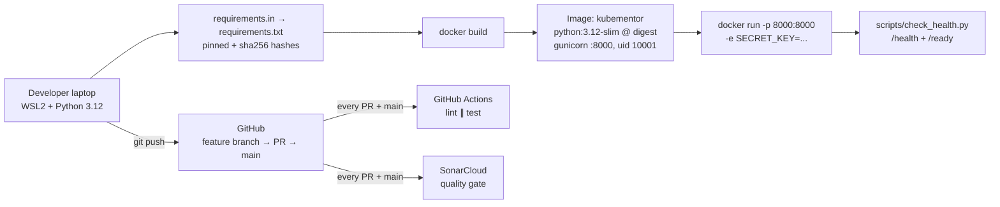
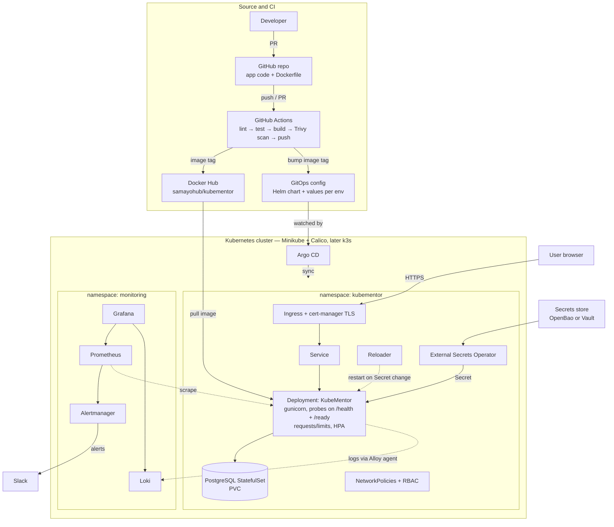
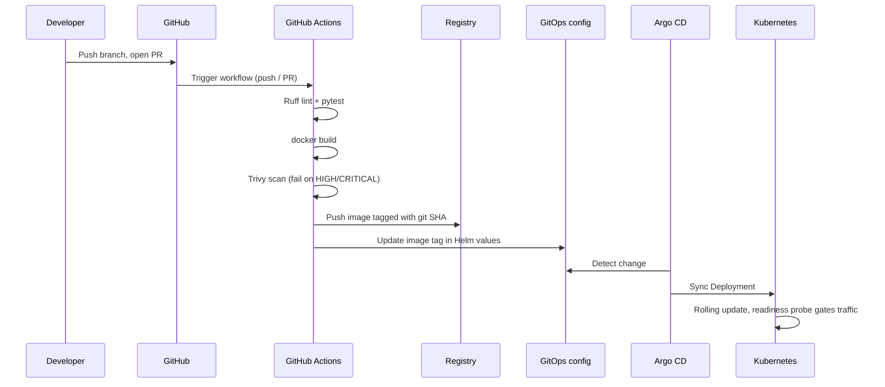

# KubeMentor Architecture

How KubeMentor is built today, where it is going, and why each piece is there.

Rule: a component is only marked **Built** when it is committed and merged to `main`. Everything else is **Planned** and may change.

Last updated: 2026-10-06 (stage: CI round 1 done — lint + test on every PR; next: build, smoke test, Trivy)

---

## 1. Architecture today

What exists now:

| Layer | Built | Notes |
|---|---|---|
| Application | Flask app factory, blueprints, `/`, `/health`, `/ready` | `/ready` is static until PostgreSQL arrives |
| Configuration | `APP_ENV` selects dev / testing / production | Fails fast on unknown env or missing `SECRET_KEY` in production |
| Tests | 7 pytest tests | Isolated from the shell environment |
| Dependencies | `.in` files compiled to hash-locked `.txt` files with `uv` | `pip --require-hashes --only-binary :all:` in the image |
| Container | Dockerfile: pinned base digest, gunicorn, non-root user | Secret injected at runtime, never baked in |
| Smoke test | `scripts/check_health.py [base_url]` | Exit code 0/1, so CI can use it; only accepts http(s) URLs |
| CI | GitHub Actions `.github/workflows/ci.yml`: `lint` (Ruff) and `test` (pytest) as parallel jobs | Runs on every PR and on `main`; read-only token; actions pinned by commit SHA |
| Static analysis | Ruff 0.16.10 (pinned) with explicit rules incl. Bandit security (`S`); SonarCloud quality gate on PRs | Gate blocks merging if new code lowers the security rating |
| CI lab | Jenkins in Docker with a private DinD engine over mutual TLS (`ci/jenkins/`) | Set up first, then replaced by GitHub Actions; kept as a lab |

---

## 2. Target architecture

### How a change reaches production (planned)

Key idea: **CI builds and proves the image; CD is pull-based.** CI never has cluster credentials. Argo CD pulls the desired state from Git, so Git is the single source of truth and drift is corrected automatically.

---

## 3. Components, why they are there, and alternatives

| Component | Status | Why | Common alternatives |
|---|---|---|---|
| Flask + gunicorn | Built | Small, readable Python service; gunicorn is a production WSGI server | Django, FastAPI + uvicorn |
| pytest | Built | First quality gate in CI | unittest |
| uv (lock files) | Built | Fast, reproducible hash-locked dependencies | pip-tools, Poetry |
| Docker | Built | Same artifact on laptop, CI, and cluster | Podman, Buildah; Kaniko inside clusters |
| GitHub Actions | Built (lint + test); build/scan/push planned | Runs on GitHub's servers: free for public repos, triggered by push/PR, ✅/❌ on every PR; never touches the cluster | GitLab CI, Jenkins (set up as a lab in `ci/jenkins/`), CircleCI |
| Ruff | Built | Lint + format in one fast tool | flake8 + black |
| SonarCloud | Built | Static analysis and quality gate on every PR; free for public repos | SonarQube (self-hosted), CodeQL |
| Trivy | Planned (next) | Free scanner for image CVEs, misconfig, secrets | Grype, Snyk |
| Docker Hub (`samayohub/kubementor`) | Planned | Stores versioned images; the AWS platform pulls from here | GHCR, ECR, Harbor (self-hosted) |
| PostgreSQL | Planned | Real data, makes `/ready` meaningful | MySQL; managed RDS / Cloud SQL |
| Docker Compose | Planned | Run app + database locally | — |
| Minikube + Calico | Planned | Local cluster; Calico enforces NetworkPolicy | kind, k3d |
| Helm | Planned | One chart, different values per environment | Kustomize |
| Argo CD | Planned | GitOps: cluster follows Git | Flux |
| cert-manager | Planned | Automatic TLS certificates | Manual certs, cloud load balancer TLS |
| OpenBao/Vault + ESO + Reloader | Planned | Secrets outside Git, synced into the cluster, apps restarted on change | Sealed Secrets, SOPS, cloud secret managers |
| Prometheus, Grafana, Loki (+ Alloy agent), Alertmanager | Planned | Metrics (pulled), logs (pushed by an agent), dashboards, Slack alerts | Datadog, New Relic, ELK |
| OpenTofu | Planned | Infrastructure as code for the cloud cluster | Terraform (BSL licence), Pulumi |
| k3s on a low-cost VM | Planned | Real, cheap "production" cluster | EKS, GKE, AKS |

---

## 4. Design decisions

| Decision | Reason |
|---|---|
| Configuration from environment variables | Twelve-factor apps: one image, many environments. In Kubernetes they come from ConfigMaps and Secrets. |
| Fail fast on missing production secret | A crash at startup is obvious; a quietly insecure app is not. |
| Separate `/health` and `/ready` | Become liveness and readiness probes: restart a dead process, but only stop traffic to a busy one. |
| Hash-locked, wheel-only dependencies | A tampered or swapped package fails the build instead of shipping. |
| Base image pinned by digest | A tag can move; a digest cannot. Updates are deliberate. |
| Non-root container user | Limits damage if the app is compromised; required by many cluster policies. |
| Pull-based GitOps (Argo CD) | CI never holds cluster credentials; Git history is the deployment history. |
| Tools rolled out in phases | Laptop has 7.6 GiB RAM for WSL2; running every stack at once will not fit. |

---

## 5. Open decisions

Decided 2026-10-06: registry is Docker Hub (`docker.io/samayohub/kubementor`); CI is GitHub Actions. Jenkins was set up first (in Docker, with a DinD engine over mutual TLS, kept in `ci/jenkins/` as a lab), then replaced by GitHub Actions because it is simpler to run, needs no laptop RAM, and reacts to pushes and PRs directly.

To be settled when the stage starts, then recorded in the journal:

- Secrets store: OpenBao (open source) vs Vault (BSL licence)
- Authentication: Keycloak (OIDC) or simpler built-in login
- Production cluster: which low-cost VM provider for k3s
